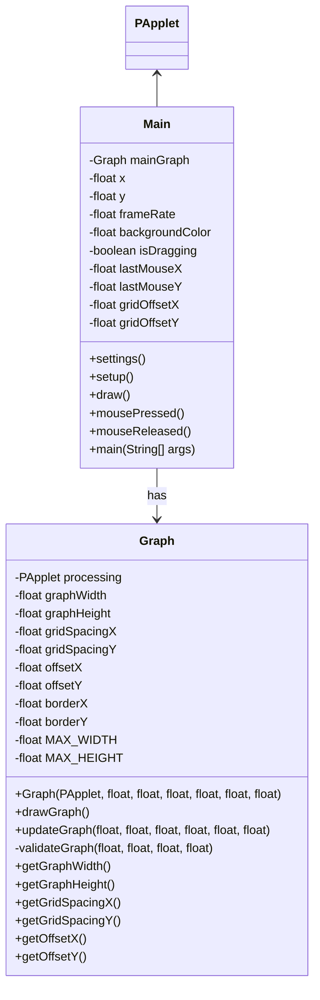

# Visualizer for Mathematical Functions

This is a simple java program that plots and visualizes mathematical functions. This project was built using the Processing framework, and Java.

## How to build and execute
*coming soon*

## Current
The program currently features:
* A pannable coordinate grid system with fixed border
* Hardcoded quadratic function visualization
* Infinite grid lines with clipping
* Smooth panning controls

## Mermaid Chart

## TO:DO
  * I don't believe processing has native button support without implementing hover/click logic. There is definitely a better way to do this. Find a solution and make possible addition to processing repo on github.
      * Then add button for returning to origin (just reset x/y offset) 
  * fix function displaying on graph at origin
  * add visible markings for origin of graph
  * Allow input
      * use _Wolfram Java API implementation_ I found on github I can use to validate the math functions
      * input for custom function
      * input validation
      * input evaluation
  * add implementations for custom functions
      * linear
      * quadratic
      * exponential
          * growth
          * decay
      * logarithmic
      * etc
  * ~~create docs for mvp~~
  * ~~update docs~~
  * Standardize and document build and run system
  * ~~Polish graph display~~
  * ~~refactor Graph class~~
  * Allow for validated user input to graph different functions
  * ~~general polish~~
  * ~~also add negative values to the graph~~
  * ~~need to refactor the way I do the translations on the graph. Check throughout the graph class as I already localized those settings to just Graph instead of having couplings in Main.~~
      * removed translations from most of the process, any translations are now abstracted and completed on assignment of related variables (only necessary on borderX/Y defined in graph.java)
  * add coordinate numbering to mouse
  * add coordinate numbering to graph
  * add customizable minX, minY
  * add customizable maxX, maxY
  * add zoom functionality
  * add grid snapping option

---
