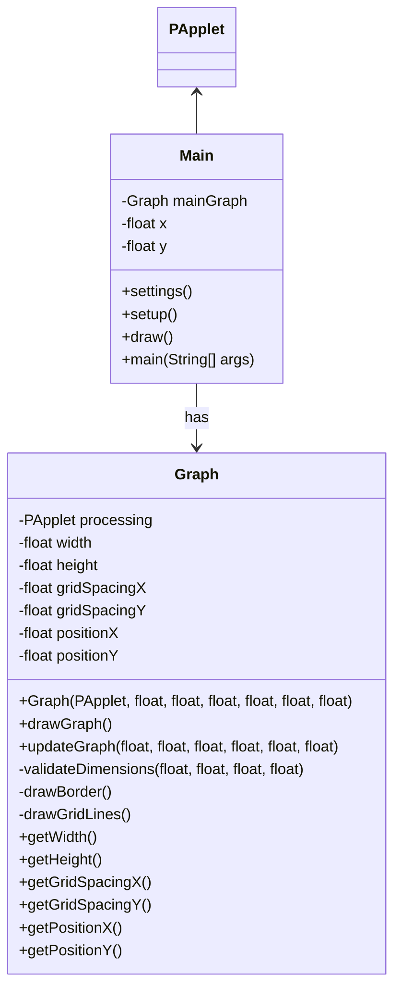

# Visualizer for Mathematical Functions

This is a simple java program that plots and visualizes mathematical functions. This project was built using the Processing framework, and Java.

## How to build and execute
*coming soon*

## Current
The program currently hardcodes a single exponential function just to test the functionality of other features.

## Mermaid Chart

## TO:DO
  * ~~create docs for mvp~~
  * Standardize and document build and run system
  * Polish graph display
  * refactor Graph class
  * Allow for validated user input to graph different functions
  * general polish
  ~~* also add negative values to the graph~~
    * need to refactor the way I do the translations on the graph. Check throughout the graph class as I already localized those settings to just Graph instead of having couplings in Main.
  * add coordinate numbering to mouse
  * add coordinate numbering to graph
  * add customizable minX, minY
  * add customizable maxX, maxY

---
that's all for now, pls [hire me](https://github.com/SedWilliams) i need money for college
